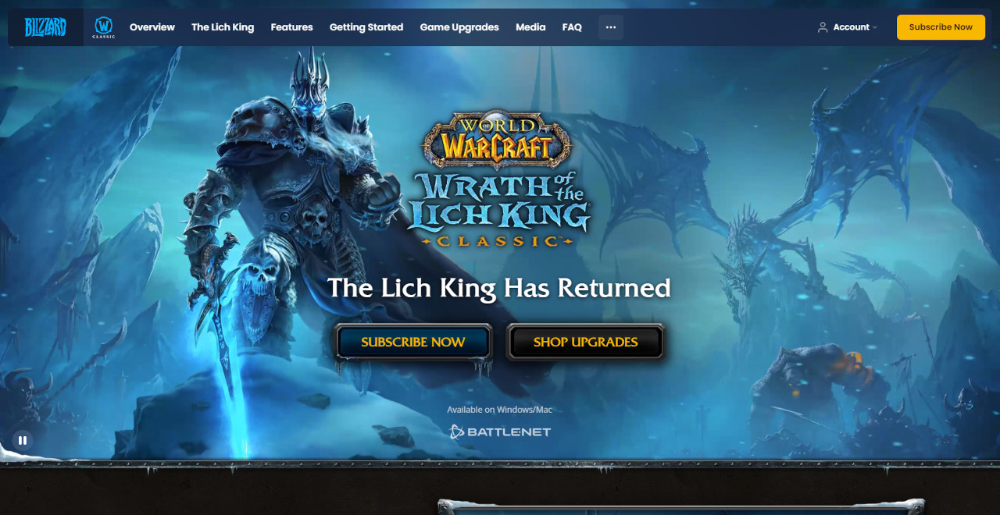

Rapport om färgval och dessa signaler
=======================

Denna rapport handlar om en samling av 3 olika webbplatser där författarna kommer redogöra för sidornas val av färgpalett och typografi samt göra en grundläggande analys av varför man tror att webbplatser valt dessa specifika färgpaletter och vilka signaler dom försöker förmedla med dessa.

Urval
-----------------------

Urvalet av sidor har framförallt fokus på att vilt skilda hemsidor med olika syften för att på så sätt få ganska vilt skilda design tankar och för att kunna jämföra dessa kort med varandra.

Metod
-----------------------

Metoden för studien kommer grunda sig på artiklar an "Introduction to color theory" och "The Charactersistcs of Minimalism", utöver denna literatur kommer jag använda mig av verktyget colorzilla för att samla färginformation på sidan.

Resultat
-----------------------

<h1>World of Warcraft Classic</h1>

Warcraft är ett varumärke som grundade sig som en spelserie vars usprungliga utsläpps datum var 1994 i USA och 1995 inom EU. Spelet har under dess tid utgivits i olika former av olika speltitlar. En av de mest populära av dessa titlar var och är World of Warcraft som släpptes ursprunglingen 2005-2006. Denna historia tycker jag är intressant eftersom publicerings datumena tycker jag reflekterar designen av de hemsidor som gjorts. I nuvarande skede finns det 2 versioner av World of Warcraft, en som är en äldre utgåva av spelet och en som är modern. Kontrasten mellan hemsidorna för dessa båda varianterna skiljer sig mycket, och just den gamla versionen har en design aspekt som återspeglar den sida som fanns tidigare medans den modernare versionen har en mer modern och minimalistisk design men behåller en del av design aspekterna.

<table style="border-spacing: 4px; border-collapse: separate">
<tr>
<td style="height: 50px; width: 50px; background-color: #ef0">
<td style="height: 50px; width: 50px; background-color: #0ef">
<td style="height: 50px; width: 50px; background-color: #f0e">
</tr>
</table>

<h1>World of Warcraft Retail</h1>

<table style="border-spacing: 4px; border-collapse: separate">
<tr>
<td style="height: 50px; width: 50px; background-color: #ef0">
<td style="height: 50px; width: 50px; background-color: #0ef">
<td style="height: 50px; width: 50px; background-color: #f0e">
</tr>
</table>

<h1>Avanza</h1>

<table style="border-spacing: 4px; border-collapse: separate">
<tr>
<td style="height: 50px; width: 50px; background-color: #ef0">
<td style="height: 50px; width: 50px; background-color: #0ef">
<td style="height: 50px; width: 50px; background-color: #f0e">
</tr>
</table>

Dokumentera dina resultat från din studie. Berätta vad du kom fram till, vilka resultat du hittade och observerade.

Analys
-----------------------

Diskutera och analysera de resultaten du fann.

Referenser
-----------------------

Ange de eventuella referenser du använder dig av, om några.

Övrigt
-----------------------

Axel Lindmark